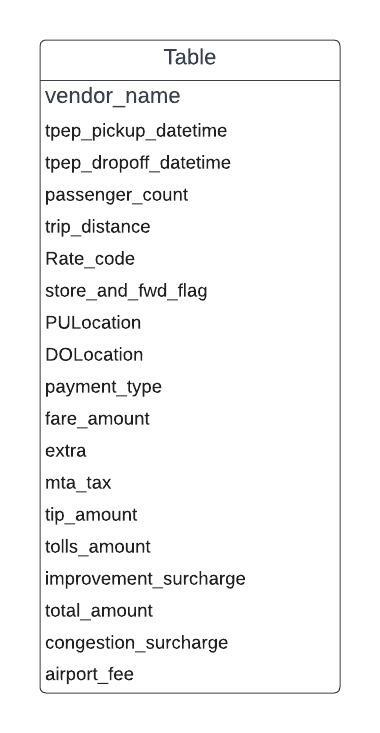
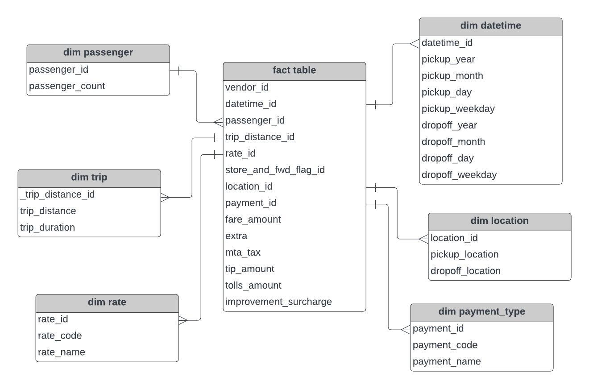
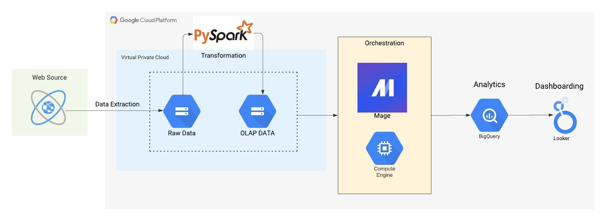

# nyc-taxi-complete-data-project

The NYC Taxi Data Analysis project is a comprehensive data engineering and analytics endeavor focused on extracting, transforming, and analyzing taxi trip data from the NYC Taxi and Limousine Commission. This project aims to provide valuable insights into taxi trips spanning over a decade, contributing to data-driven decision-making in various sectors.

## OLTP Design

The OLTP (Online Transaction Processing) design of this project focuses on managing transactional data from the source.It is the format in which the data extracted from the links is stored.
 The structure of the OLTP system involves:
- **Data Sources:** Data is collected from a specific source, such as the NYC Taxi and Limousine Commission website.
- **Database:** The transactional data is stored in a database optimized for quick data insertion and retrieval.
and managing individual transactions.
- **Parquet Files** Data stored in the database is stored as parquet files in "website".

We scrape the links of these files and extract data from them to create our project.

## OLAP Design

The OLAP (Online Analytical Processing) design is geared towards analyzing and reporting on historical data. The OLAP architecture includes:
- **Dimension Tables:** Various dimension tables (e.g., Passenger, Trip, Location) are created to categorize and organize data attributes.
- **Fact Table:** The fact table contains aggregated and pre-processed data from various dimensions for efficient analysis.

## Architecture

The architecture of the project consists of the following components:
- **Data Collection:** Data is scraped from the NYC Taxi and Limousine Commission website using the Link Extractor.
- **Data Transformation:** PySpark is utilized to process and transform the raw data into structured OLAP tables.
- **Data Storage:** Raw Data Obtained from Link Extractor and Processed data is stored in Google Cloud Storage as OLTP and OLAP tables.
- **Orchestration:** Mage.ai is used to orchestrate the ETL (Extract, Transform, Load) process.
- **Analysis:** Data is queried using Google BigQuery, enabling complex analyses and aggregations.
- **Visualization:** Looker is employed to create dashboards and visualizations for data exploration.

## Scraping and Uploading Data

The data scraping process involves:
- Using the Link Extractor to identify relevant links for different years' data.
- Fetching data from each link using the Data Collector.
- Uploading the fetched data to Google Cloud Storage as Parquet files organized by year.

This process ensures that raw data is collected, stored securely, and prepared for transformation and analysis.

## Data Transformation with PySpark

The scraped data undergoes multiple transformations using PySpark:
- **Dimension Tables:** DimPassenger, DimTrip, DimLocation, DimRate, DimPaymentType, DimDateTime are created from relevant data attributes.
- **Fact Table:** The FactTable is generated by joining dimension tables using Spark SQL operations.
- **Caching and Broadcasting:** To optimize query performance, smaller dimension tables are cached and broadcasted.

## Data Orchestration with Mage

The ETL process is orchestrated using Mage:
- **DAG Definition:** Directed Acyclic Graph (DAG) is created to define the workflow of data extraction, transformation, and loading.
- **Scheduling:** The DAG is scheduled to run at specified intervals, ensuring timely data updates.
- **Monitoring:** Mage's dashboard allows monitoring of task progress, scheduling, and task history.

## Querying in Google BigQuery

Data is queried in Google BigQuery for analysis:
- **Data Import:** OLAP tables are imported from Google Cloud Storage to BigQuery.
- **SQL Queries:** Complex SQL queries are written to analyze data across dimensions, aggregations, and time periods.
- **Performance Optimization:** BigQuery's columnar storage and parallel processing optimize query performance.
- **Cost Considerations:** Partitioning and clustering are used to manage costs associated with data storage and processing.

## Creating a Dashboard in Looker

A dashboard is created in Looker to visualize and explore data:
- **Integration:** Looker is connected to Google BigQuery to access OLAP data.
- **Visualizations:** Interactive charts, graphs, and tables are built to represent insights.
- **Reports:** Looker reports provide a comprehensive overview of data trends and patterns.
- **Sharing:** Dashboards can be shared with stakeholders for collaborative decision-making.

## Conclusion

In this project, we designed an end-to-end data pipeline that starts with scraping data from a website, transforming it with PySpark, orchestrating the process with Apache Airflow, and analyzing it in Google BigQuery. The data is then visualized using Looker dashboards, enabling users to derive meaningful insights and make informed decisions.

This project showcases the power of data engineering, processing, and visualization in modern data-driven applications.

---
